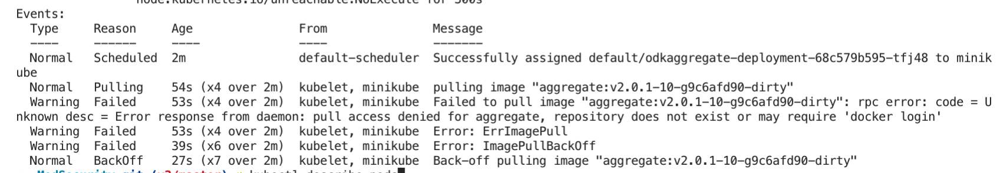

Draft: yes
Tags: kubernetes, lab-notes, migrating-odk-to-k8s, odk, #draft
Summary: In which I attempt 

# Lab Notes: Migrating ODK Aggregate from Fargate to Azure Kubernetes Services (part 3)

*I'm working on deploying an Aggregate 2.0 instance to Kubernetes in the cleanest possible way, and documenting my [progress in these lab notes](/tagged/migrating-odk-to-k8s).*

Now it's time to test ODK in Kubernetes! 

I already had Minikube installed, so I simply ran:

```minikube start``` 

I'm studying for my KCAD, so luckily I already had the k8s object syntax fresh in my head, and writing up a simple `deployment.yaml` was easy. I chose to embed all my objects into one file - I'm not sure if this is good or bad practice, but it's sure a lot easier to manage.

My first goal is to ensure the config changes I recently made are working, so I run:
	
`kubectl apply -f docker/k8s.yml`

After a couple of seconds, I run:

`kubectl describe pods`

And I get:



This is because `minikube` handles 
