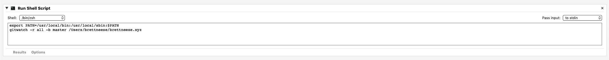

Draft: Yes
Category: Quick Tip

# Running Background Shell Scripts Using Automater

As part of some recent housekeeping, I recently swapped the backend of this blog (powered by the wonderful Blot.io) from Dropbox to Git -- the reason being that I wanted an easy way to share drafts with friends if necessary. Unfortunately there's not a good a good Google Docs for Markdown files in Dropbox, but everyone knows how to use GitHub[^1].

That being said, I didn't want to fuss with issuing Git commands every time I update a post. I really like the Dropbox UX - I just save, and the post is live. If I ever want to fix a typo in any post, I just fix it in my local editor and save. It's a workflow I love. The distance between thought and publish is as minimal as possible, as I believe it should be (I can mark posts as drafts before they get published.)

So I found and installed `git-watch`, a script that monitors my blog directory and automatically commits and pushes to both by Blot remote and my GitHub remote on every file save. But I wanted this to run always, just like Dropbox did. 

Thankfully, it's easy to wrap shell scripts into Automater actions -- just open Automater, click "new application" and add a "run shell script action."



I had to update my PATH environmental variable in this script to my `brew` directory because it does not automatically source my local `.zshrc`. For easy copypastaing, that's:

```
export PATH=/usr/local/bin:/usr/local/sbin:$PATH
gitwatch -r all -b master /Users/brettneese/brettneese.xyz
```

When you do so, you even get this cool little icon in your menu bar telling you an Automater action is running in the background, so I can verify it is running... which is awesome, and exactly what I wanted. 


(I do want to pump `stderr` out as a notification somewhere, though, because sometimes there are conflicts I have to manually go in and fix.)

[^1] Several of my friends have asked me to use Google Docs for sharing drafts. I don't like this because it's so widely different from my usual Markdown workflows. 