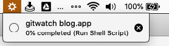
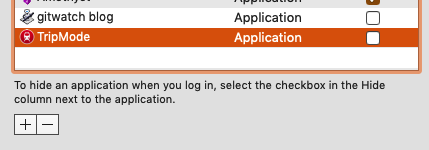

Category: Quick Tip
Draft: no

# Running Background Shell Scripts Using Automater

As part of some recent housekeeping, I recently swapped the backend of this blog (powered by the wonderful [Blot.io](https://blot.io) from Dropbox to Git -- the reason being that I wanted an easy way to share drafts with friends if necessary. Unfortunately there's not a good a good Google Docs for Markdown files in Dropbox, but everyone I could possibly want to share with already knows how to use GitHub for collaboration[^1].

That being said, I didn't want to fuss with issuing Git commands every time I update a post. I really like the Dropbox UX - I just save, and the post is live. If I ever want to fix a typo in any post, I just fix it in my local editor and save. It's a workflow I love. The distance between thought and publish is as minimal as possible, as I believe it should be (I can mark posts as drafts before they get published.)

So I found and installed [`gitwatch`](https://github.com/gitwatch/gitwatch), a script that monitors my blog directory and automatically commits and pushes to both by Blot remote and my GitHub remote on every file save[^2].

But I wanted this to run always, just like Dropbox did. The less I have to think about the process of getting the writing out of my head and into somewhere useful, the more writing (and the more publishing) I can and will do. 

Thankfully, it's easy to wrap shell scripts into Automater applications -- just open Automater, click "new application" and add a "run shell script" action.


I had to update my PATH environmental variable in this script to my `brew` directory because it does not automatically source my local `.zshrc`. For easy copypastaing, that's:

```
export PATH=/usr/local/bin:/usr/local/sbin:$PATH
gitwatch -r all -b master /Users/brettneese/brettneese.xyz
```

When you do so, you even get this cool little (spinning) icon in your task bar[^3] telling you an Automater action is running in the background, so I can verify it is running... which is awesome, and exactly what I wanted. I even madly Googled around for how to add an icon for an Automater action to the task bar only to learn that functionality is included by default! 



Plus, I can add it to my Login Items in System Preferences so it's always running:



And now I've gotten the functionality I liked in Dropbox using just Git and `gitwatch`! 

I will be sharing some more about my writing and editing workflow in future notes like this one. 

(I do want to pump `stderr` out as a notification somewhere, though, because sometimes there are conflicts I have to manually go in and fix.)

[^1]: Several of my friends have asked me to use Google Docs for sharing drafts. I don't like this because it's so widely different from my usual Markdown workflows. 

[^2]: Yes, my Git commit history is a bit messy with "auto-committed on $time" commit messages. It's still much better to have version control than to not have it, and I can always stop `gitwatch` if I want to go really off the rails. I just hope I don't blow up the repo with too many commits, although that seems unlikely.

[^3]: The spinning would be annoying except I use [Bartender 3](https://www.macbartender.com/) to hide the icon by default. 