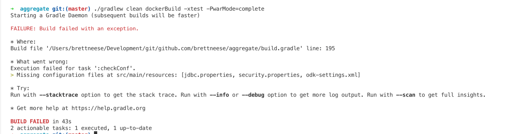
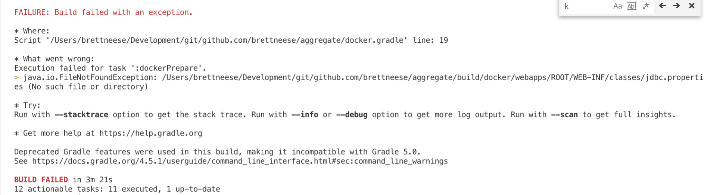

Date: 06/02/2019

Category: Lab Notes

Tags: kubernetes, odk, migrating-odk-to-k8s

Summary: Why I'm doing this, and I begin to experiment with ODK Aggregate on k8s by sending in a PR that tweaks ODK's build process for Docker.

# Migrating ODK Aggregate from Fargate to Azure Kubernetes Services (part 1)

*I’m working on deploying an Aggregate 2.0 instance to Kubernetes in the cleanest possible way, and documenting my progress in [these lab notes](/tagged/migrating-odk-to-k8s).*

I'm beginning to experiment with migrating a [ODK Aggregate](https://github.com/opendatakit/aggregate/) instance running on Fargate to Azure Kubernetes Service. These next few posts will log my progress. 

*Note: this is not a "how to." This is a "How I did!" - I'll be writing down all the steps and missteps in posts like this.*

The reasons for this migration are multiple:
 - We're finding that the ODK server on Fargate is scaling early and often, but seems to have trouble scaling back. As such, it's the most expensive part of our AWS bill
 - I work inside a small team inside a larger organization which uses Office 365 and Azure AD for authentication. This means it's quite easy to share resources in an Azure account created under the main organization with other parts of the organization. 
 - We didn't originally set up separate AWS accounts for different applications. This is a best practice I should've followed for ODK, which is separate from the main web application I'm responsible for
 - Azure's resource groups are a lot better at organizing resources that Amazon's tags (because I presume the idea is you'll create multiple AWS accounts for each application)
 - ODK recently released 2.0, but it'd be far too obnoxious to update our Fargate configuration
 - I want to learn Kubernetes, and AKS is cheaper than EKS, which charges a base fee for the master as well as for compute. For AKS, the master is free.

# Running locally

The first step is getting ODK running locally. 

I was delighted to learn that in the many years since I touched ODK Aggregate the docs have improved considerably, and there's even an official Dockerfile in the repo

They are not, yet, however, releasing images on Docker Hub. I'd like to help them out with this, and after I get it running locally I might submit a PR to add Docker publishing to their CircleCI config. 

I cloned down the repo and followed the instructions to build the Docker image:

It turns out I didn't actually follow the instructions, which require I rename the .example config files to not include the .example. 

Configuring ODK has always been a giant PITA -- it doesn't natively support environment variables, so the entrypoint script does a lot of weird Bash things to a some special env vars and place them into configuration files -- but it's possible I might be able to simplify that, so while I could rename those files per the instructions, for now I'm going to change that [exception to a warning](https://github.com/brettneese/aggregate/commit/1a6c4aff0de421e1b3d82501947bdb3abc931f58).

Predictably, this also fails:

I learned here that the Docker build script seems to replace all the values in those files anyway, so I'm safe to do something like [this](https://github.com/brettneese/aggregate/commit/47c4e74323617418dd922752839c29644001cba7), instead.

And since I know that happens, I can go ahead and do [this](https://github.com/brettneese/aggregate/commit/f62eff99d454757503f0e8d58b9f7bb3faed63ec).

This seems fairly hacky though, so I'm going to submit this as a [PR](https://github.com/opendatakit/aggregate/pull/439) and see what the team says.

(Update: it got accepted! [Time to tweak the configuration even more.](https://brettneese.xyz/lab-notes-migrating-odk-aggregate-from-fargate-to-azure-kubernetes-services-part-2))

