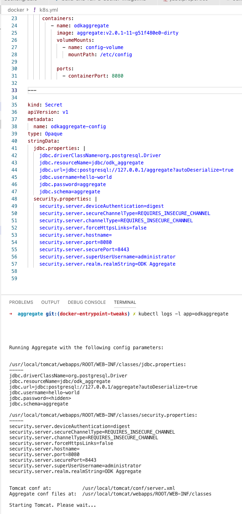

# Migrating ODK Aggregate from Fargate to Azure Kubernetes Service (part 3)

*I'm working on deploying an Aggregate 2.0 instance to Kubernetes in the cleanest possible way, and documenting my [progress in these lab notes](/tagged/migrating-odk-to-k8s).*

Now it's time to test ODK in Kubernetes! 

I already had Minikube installed, so I simply ran:

```
minikube start
```

I'm studying for my [CKAD](https://www.cncf.io/certification/ckad/), so luckily I already had the k8s DSL fresh in my head, and [writing up a simple `k8s.yml` was easy](https://github.com/brettneese/aggregate/commit/bd040e50beed57f0ea423a9d7248c0a590e5735b). I chose to embed all my objects into one file - I'm not sure if this is good or bad practice, but it's sure a lot easier to manage.

My first goal is to ensure the config changes I recently made are working, so I run:
	
```
kubectl apply -f docker/k8s.yml
kubectl describe pods
```

And I get:


This is because `minikube` has its own Docker daemon. I need to  run:

```
eval $(minikube docker-env)
```

To point my local Docker daemon at Minikube and rebuild. 

Now when I do:

```
kubectl apply -f docker/k8s.yml
kubectl describe pods
kubectl logs -l app=odkaggregate
```

I get: 



Which is exactly what I want! The [config tweaks](https://brettneese.xyz/lab-notes-migrating-odk-aggregate-from-fargate-to-azure-kubernetes-services-part-2) are working! 

