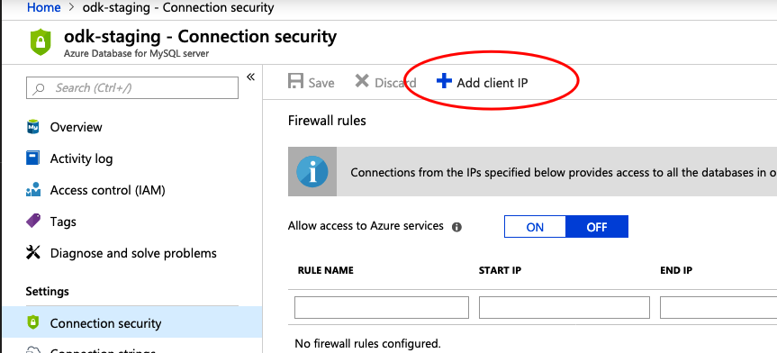

Category: Lab Notes
Tags: #kubernetes , #labnotes , #migratingodktok8s , #odk , #migratingodktok8s , migrating-odk-to-k8s
Summary: In which I chronicle the struggles of connecting ODK to a real database.

# Migrating ODK Aggregate from Fargate to Azure Kubernetes Service (part 4)


*I'm working on deploying an Aggregate 2.0 instance to Kubernetes in the cleanest possible way, and documenting my [progress in these lab notes](/tagged/migrating-odk-to-k8s).*

Now that I know the config magic I've worked on in the past couple posts is working, I can try spinning up and connecting to a real database! 

Our existing ODK installation uses MySQL, although this is no longer recommended and fresh installs should use PostgreSQL. I don't believe in managing my own databases, so I'm going to use [Azure Database for MySQL](https://azure.microsoft.com/en-us/services/mysql/). Thankfully, it's pretty easy to launch a database using Azure Database Service - I won't walk through that process here.

I do, however, have to login to the database and initialize it. I initially struggled to find the right command to connect, often running into an error such as:

```
ERROR 9002 (28000): The connection string may not be right. Please visit portal for references.
````

Thanks to [StackOverflow](https://stackoverflow.com/questions/44035710/connection-to-azure-mysql-server-fails-due-to-incorrect-connection-string#44035711), I learned the correct connection command for `mysql` is actually: 

```
mysql -u mysql@odk-staging.mysql.database.azure.com -h odk-staging.mysql.database.azure.com -p

```

My mistake was that the username _must_ be `mysql@odk-staging.mysql.database.azure.com` -- including the hostname.

I also ran into an issue with my IP address:

```
ERROR 9000 (HY000): Client with IP address '$MYIP' is not allowed to connect to this MySQL server.
```

And had to manually navigate to the "Connection Security" tab in the Azure Portal and add my IP to the whitelist.



Now that I'm in, I can simply execute:

```
CREATE DATABASE aggregate;
GRANT ALL ON aggregate.* TO odk@'%' IDENTIFIED BY '$password';
FLUSH PRIVILEGES;
```

This is a bit different from the command in the ODK Help guide - I learned through a bunch of trial and error that it is unnecessary to create a MySQL user _and_ a database-scoped user for "aggregate" - I spent an hour figuring out why I couldn't connect when it turns out that global users and database-scoped users have their own passwords! 

I can now update my `k8s.yml` with the proper connection details. These can be easily found in the "Connection Strings" link in the Azure Portal.

Because I'm using the MySQL connection type, I also have to include a custom `odk-settings.xml` in my `k8s.xml`. My final `k8s.yaml` at this point looks something like [this](https://gist.github.com/brettneese/bfa394df430aed8e432b5d864dc855e6). 

Another stumbling block I ran into: apparently Java does not like the symlinks I created in the [previous step](./), and when loading the symlinked properties files threw `Java.io.FileNotFound` errors. This is unfortunate for a number of reasons, but is begrudgingly fixed by `cp`ing the values from the mounted directory into the config directory, instead of symlinking them.[^1]

Finally, it looks like ODK is connecting to the database and making tables. Next, I need to figure out how to access the service locally...


[^1]: This is less than ideal because it means that secrets aren't stored on tmpfs volumes.

